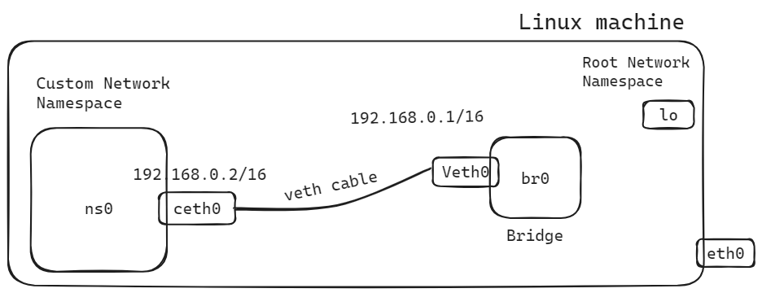
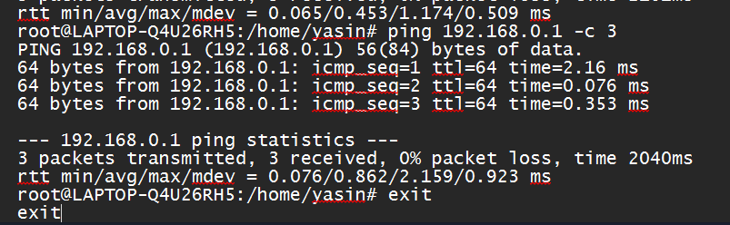
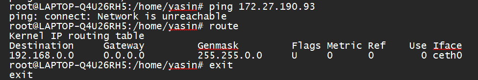
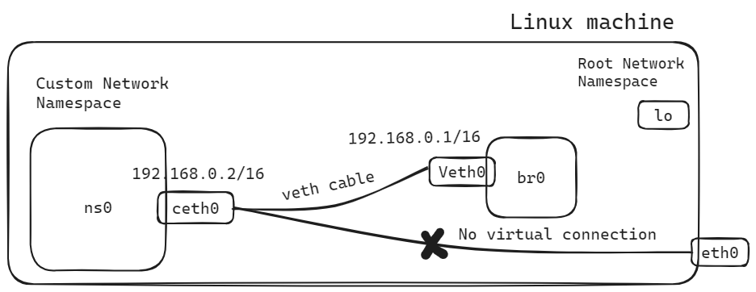
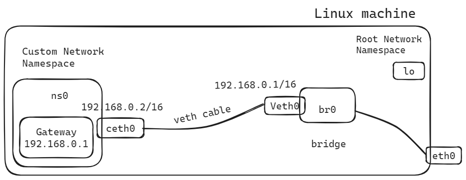
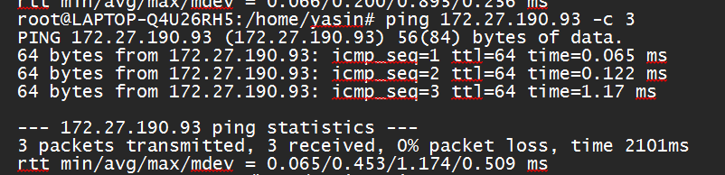
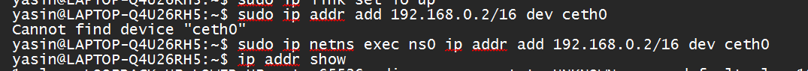

# Connecting a container network namespace to root network namespace

Connecting a container's network namespace to the root network namespace allows containers to communicate with the host system and other containers, as well as external networks.



### 1. Create a custom network namespace

To accomplish this task first of all we can create a custom network namespace.

### 2. Configuration of the bridge interface

Configuring a bridge interface involves creating the bridge, adding network interfaces to it, and optionally configuring additional settings such as IP addresses and forwarding.

### 3. Veth cable for communication

A Veth cable establishes a virtual Ethernet connection between two network namespaces, enabling communication between them. It functions as a bidirectional pipe, allowing data transmission between the connected namespaces.

### 4. Assigning IP address

Assigning IP addresses to the end interfaces of the cables enables network communication within their respective namespaces, facilitating data exchange between containers and the host system.

## Check connectivity

For checking connectivity, we can ping from the custom namespace to bridge interface



But if we want to ping any other ip addresses like want to communicate with eth0 interface. It is not possible as there is no virtual connection between them. It will say Network is unreachable.





The routing entry indicates that traffic destined for the `192.168.0.0` network (with a subnet mask of `255.255.0.0`, effectively covering the entire `192.168.x.x` address range) should be sent out through the ceth0 interface. However, there is no default gateway specified (indicated by the gateway `0.0.0.0`), which means that the system does not have a specific route for sending packets to networks outside the `192.168.0.0/16` range.


## How to solve this problem?

To solve this problem we can add a default gateway.

```bash
ip route add default via 192.168.0.1
```

This command adds a default route to the routing table within the network namespace (ns0). via `192.168.0.1` specifies the gateway IP address to use for packets matching the default route. In this case, packets will be forwarded to the gateway with the IP address `192.168.0.1` for further routing. No we can ping eth0.





## Problems and solutions

When we configure ns0 namespace by using sudo ip addr add 192.168.0.2/16 dev ceth0 this command we face an error



In this command, ceth0 dev is not found because ceth0 is configured to ns0 namespace. So, we have to execute this command in the ns0 namespace as it is completely isolated from the root namespace.

