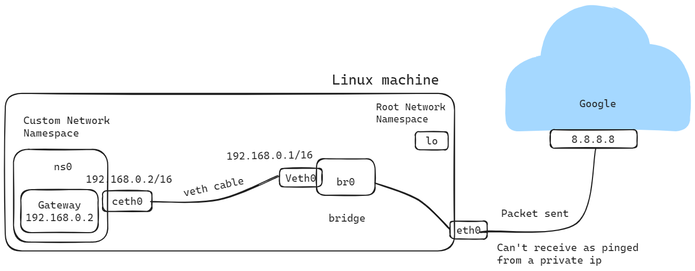
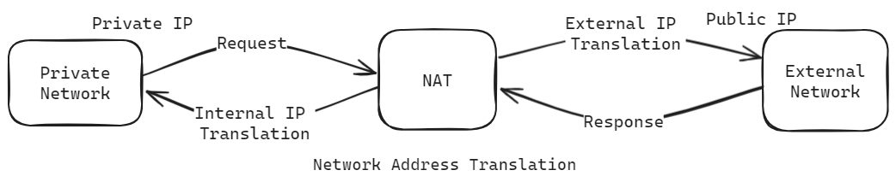

# Egress Traffic

Egress traffic refers to the network traffic that is leaving or being transmitted from a specific network or device. It represents the data flow from the internal network to an external network or destination. In simpler terms, egress traffic is the outbound traffic from a network or device to another network or the internet.

## Connecting a container network namespace to root network namespace

### Steps:

1. **Create a custom network namespace and a bridge**:
   - A network namespace is an isolated network environment that contains its own network interfaces, routing tables, and firewall rules.
   - A bridge is a software-based network switch that connects multiple network interfaces together within a single network segment.

2. **Configure a bridge interface**:
   - Once the bridge is created, bring it up using the `ip link set` command

3. **Configure virtual Ethernet cable**:
   - Virtual Ethernet (veth) pairs are used to connect network namespaces to bridges or other network namespaces.

4. **Assign an IP address to the created namespace and turn loopback interface into UP state**:
   - Use the `ip addr add` command to assign an IP address to the veth interface within the custom namespace.
   - Bring up the loopback interface within the namespace using the `ip link set` command.

5. **Add a Default Gateway in the route table**:
   - Add a default gateway to the route table within the custom namespace using the `ip route add default via` command

6. **Namespace to root ns Communication using ping**:
   - Verify connectivity between the custom namespace and the root namespace by using the `ping` command

## Now trying to ping from ns0 to external service 8.8.8.8 [egress traffic]

If we run this command

```bash
ping 8.8.8.8 -c 3
```


It will fail because the namespace is not connected to the internet. The situation here is that a device with the source IP address `192.168.0.2` is trying to establish a connection with Google's public DNS server at `8.8.8.8`. However, it's important to understand that the device is using its private IP address `(192.168.0.2)` to reach out to the external destination. In the realm of networking, private IP addresses like `192.168.0.2` are used within local networks and are not routable on the internet. Therefore, external networks are unaware of these private IP addresses, making it impossible for them to route packets back to the device using its private IP address. Consequently, while the packets from the device are successfully reaching Google's DNS server, the server is unable to reply back to the device's private IP address, resulting in the lack of responses.

## How to solve this connectivity problem?

To address the current connectivity problem, we need to change the private IP address to a public one. This can be accomplished by employing Network Address Translation (NAT), specifically through Source NAT (SNAT). Consequently, we'll need to insert a SNAT rule into the IP table, specifically within the POSTROUTING chain.



```bash
sudo iptables -t nat -A POSTROUTING -s 192.168.0.0/16 -j MASQUERADE
```

This command configures iptables, the Linux firewall utility, to perform Network Address Translation (NAT) for packets leaving the network with a source IP address in the range `192.168.0.0/16`. Here

- `-t nat`: Specifies the table to operate on. In this case, it's the "nat" table, which is responsible for network address translation (NAT).
- `-A POSTROUTING`: Appends a rule to the "POSTROUTING" chain. This chain is traversed by packets after they have been routed and before they are sent out from the system.
- `-s 192.168.0.0/16`: Specifies the source IP address range for matching packets. In this case, it's the private IP address range `192.168.0.0/16`, commonly used in local network configurations.
- `-j MASQUERADE`: Specifies the target action to perform if a packet matches the criteria defined by the rule. Here, `MASQUERADE` is used to perform source NAT (SNAT), which replaces the source IP address of the packet with the IP address of the outgoing interface (the interface used to send the packet out to the internet). This allows packets from the local network to appear as if they originated from the router's public IP address when communicating with external networks.

## Some firewall rules in case if still not works

```bash
sudo iptables --append FORWARD --in-interface br0 --jump ACCEPT
sudo iptables --append FORWARD --out-interface br0 --jump ACCEPT
```
The first command allows incoming packets from the `br0` interface to be forwarded, while the second command allows outgoing packets to be forwarded through the `br0` interface. Both commands append rules to the "FORWARD" chain in iptables, specifying the action to "ACCEPT" packets that match the criteria defined by the rules. This effectively permits the forwarding of packets through the system via the specified bridge interface without further processing.

Now this command `ping 8.8.8.8 -c 3` will work.