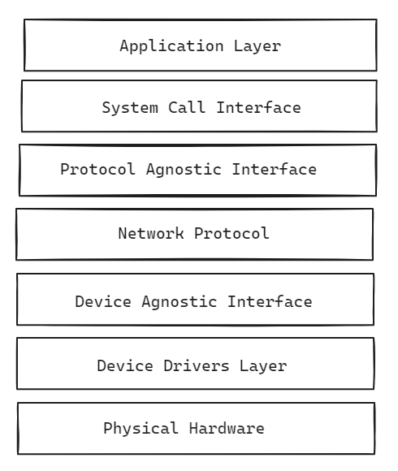

## Overview of Linux networking

Linux networking encompasses the various components and configurations involved in establishing and managing network connections on systems running Linux-based operating systems.

Linux provides tools and utilities for configuring network interfaces, IP addresses, routes, and DNS settings. Command-line tools include `ifconfig` (legacy) and `ip`, along with utilities like `route` and `netstat` are used for network configuration. Linux supports a variety of network interface types. Each network interface has its own configuration settings, such as IP address, netmask, gateway, and MTU (Maximum Transmission Unit).

Linux uses a routing table to determine how to forward network packets to their destinations. The routing table contains entries that specify the destination network or host, the gateway (next hop), and the network interface to use for forwarding packets. Commands like `ip route` and `route` are used to view and manipulate the routing table.

Linux includes built-in packet filtering and firewall capabilities, primarily through the `iptables` (legacy) and `nftables` (modern) frameworks. These tools allow administrators to define rules for filtering, accepting, rejecting, or manipulating network packets based on various criteria, such as IP addresses, ports, protocols, and connection states.

Linux provides tools for monitoring network activity, diagnosing connectivity issues, and troubleshooting network problems. Utilities like `ping`, `traceroute`, `netstat`, `tcpdump`, and `wireshark` are commonly used for analyzing network traffic, identifying network bottlenecks, and debugging network configurations. Linux also includes features for securing network communications and protecting against unauthorized access.

## Understanding linux network stack

The Linux network stack comprises seven layers, each with specific functions to enable network communication. It operates in two directions: A request from a client and response from the server of that request.

The layers are categorized into three sets: User Space (topmost layer), Kernel Space (next five layers), and Physical Layer (final layer).

1. **User Space (Application Layer)**: Where user applications reside, such as browsers or file-sharing applications. Applications in this layer interact with the network, accessing files or resources over the network.

2. **System Call Interface (SCI)**: Handles calls from the Application Layer to the Kernel. For instance, a word processor might issue a read call to the Kernel to request a file from a network location.

3. **Protocol Agnostic Interface**: Responsible for creating and managing sockets, which facilitate communication between applications. Sockets are identified by unique IDs (similar to TCP/IP ports) and are used for transmitting and receiving data.

4. **Network Protocol**: Determines how data is sent or received across the network. It handles routing information, particularly in networks with routers.

5. **Device Agnostic Interface**: Connects data between the Kernel and network device drivers.

6. **Device Drivers Layer**: Contains the actual device drivers for network hardware, preparing data for transmission over the network medium.

7. **Physical Hardware**: The physical network hardware where data packets are transmitted and received. This includes both wired and wireless network mediums.

## What Is a Network Interface?

A network interface is the point of connection between a computer and a network. In other words, how the Linux system links up the software side of networking to the hardware side.

### Network Interface Types
The Linux system distinguishes two types of network interfaces – the physical network interface and the virtual network interface.

1. A physical network interface represents a network hardware device such as NIC (Network Interface Card), WNIC (Wireless Network Interface Card), or a modem.

2. A virtual network interface does not represent a hardware device but is linked to a network device. It can be associated with a physical or virtual interface. It can server various purposes like Loopback interface, Virtual Ethernet Interfaces etc

### Loopback Interface (lo)

The loopback interface is a special virtual network interface that computer uses to communicate with itself. It is used mainly for diagnostics and troubleshooting, and to connect to servers running on the local machine.

The primary purpose of the loopback interface is to enable network communication between applications running on the same device without involving any physical network hardware or external networks.
It provides a mechanism for testing network-related functionality, accessing local services, and troubleshooting network configurations without relying on external connections.

The loopback interface is associated with a special IP address known as the loopback address or localhost address. In IPv4, the loopback address is `127.0.0.1`, and in IPv6, it is `::1`.

Any data sent to the loopback address is internally looped back to the same device, allowing applications to communicate with themselves.

### eth0

The eth0 interface on a Linux system serves as the primary Ethernet network interface. eth0 enables the Linux system to connect to Ethernet-based local area networks (LANs) or the internet. eth0 handles the sending and receiving of data packets to and from other devices on the network. It encapsulates outgoing data packets with appropriate Ethernet headers and processes incoming packets by removing their headers and passing the payload to the operating system.

