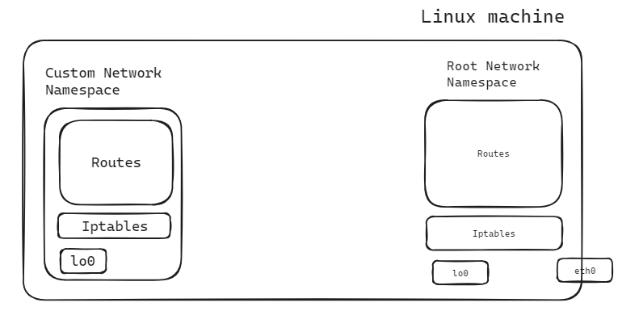
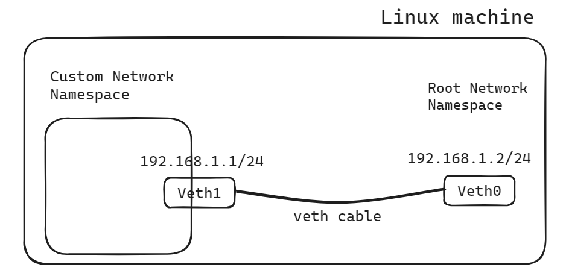

# Connecting a custom namespace to host using virtual Ethernet cable

Connecting a namespace to a host using a virtual Ethernet cable provides a seamless and efficient means of facilitating network communication between the namespace and the underlying host system.



# What is a virtual Ethernet cable?

A virtual Ethernet cable or a `veth cable`, more commonly known as a veth pair or a virtual Ethernet pair, is a type of virtual network interface in Linux. It consists of two interconnected virtual Ethernet interfaces that behave like the ends of a physical Ethernet cable and creates a direct, low-latency link between a container and the host system's network stack.

Here's how a veth pair typically works:

**Pairing**: A veth pair is created as a set of two virtual Ethernet interfaces, usually named veth0 and veth1. These interfaces are linked together internally within the kernel.

**Endpoints:** One end of the veth pair (e.g., veth0) is placed within a specific network namespace, container, or virtual machine, while the other end (e.g., veth1) is typically placed within another network namespace, container, or virtual machine.

**Communication:** When packets are sent through one end of the veth pair (e.g., veth0), they emerge at the other end (e.g., veth1) as if they had traversed a physical Ethernet cable. This allows network communication between the connected endpoints, even though they may be in separate network namespaces or containers.

# How to create a veth cable?

To create a virtual Ethernet (veth) pair, `ip link` command can be used in Linux.

```bash
sudo ip link add veth1 type veth peer name veth0
```

In this command:

- `ip link add`: This command adds a new network interface.
- `veth0` and `veth1`: These are the names of the two ends of the veth pair. 
- `type veth`: This specifies the type of network interface to create, in this case, a virtual Ethernet interface.
- `peer name veth0`: This specifies the name of the other end of the veth pair.

3. After running the command, to verify that the veth pair has been created by running:

```bash
ip link show
```

This command will display a list of network interfaces inside the root namespace.

# How to connect a namespace to a veth cable?

The newly created veth cable with two veth pair resides into the root namespace. Then one end of the veth pair need to attach to the custom network namespace. This can be done by `ip link` set command.
```bash
sudo ip link set veth1 netns custom_namespace
```



# Configuration of the network

To configure the IP address of the container and the host namespace (host system):

1. Assign IP address to the veth interfaces:
On the host system, assign an IP address to one end of the veth pair (veth0).
Inside the container, assign an IP address to the other end of the veth pair (veth1).
2. Set up routing:
On the host system, add a route for the container's IP subnet via the veth interface.
Inside the container, add a default route pointing to the veth interface.

# Connectivity test

To test the connectivity between the container and the host namespace after configuring their IP addresses and routes, we can use `ping` command.

## From the custom namespace
```bash
ping 192.168.1.1 -c 3
```

## From the host namespace
```bash
ping 192.168.1.2 -c 3
```
The command `ping 192.168.1.1 -c 3` is used to send `ICMP` (Internet Control Message Protocol) `echo` requests to the IP address `192.168.1.1` three times.


