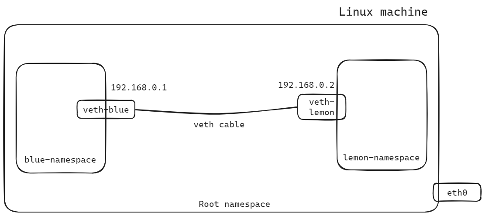

# Setting up Virtual Network between Namespaces

Setting up a virtual network between namespaces involves creating a logical network connection between different namespaces within a root namespace. Namespaces are used to provide isolation and segmentation in various computing platforms. This virtual network enables communication between applications or services running in different namespaces while maintaining the desired level of isolation.

## What is IP forwarding in linux karnel?

In Linux kernel networking, IP forwarding refers to the process of routing network packets from one network interface to another. When a system acts as a router or a gateway between different networks, IP forwarding allows it to efficiently forward packets between these networks based on their destination IP addresses.

```bash
sudo sysctl -w net.ipv4.ip_forward=1
```

IP forwarding is typically controlled through the `sysctl` interface in Linux, where administrators can enable or disable forwarding functionality. Enabling IP forwarding allows a Linux system to function as a `router` or `gateway`, facilitating the flow of network traffic between different networks or subnets.



## Steps to set up the Virtual network between namespaces

1. First of all we have to enable IP forwarding. Otherwise the two namespaces can not communicate between them. When a network packet arrives at a Linux system, the kernel examines its destination IP address to determine whether it should be forwarded to another network. If IP forwarding is enabled, the kernel considers the packet for routing. Once the outbound interface is determined, the kernel forwards the packet to that interface for transmission.

2. Namespaces creation and veth cable setup as NIC.

3. Assignment of IP addresses to the veth cable interfaces.

4. Default route set up.

5. Then finally connectivity test.


