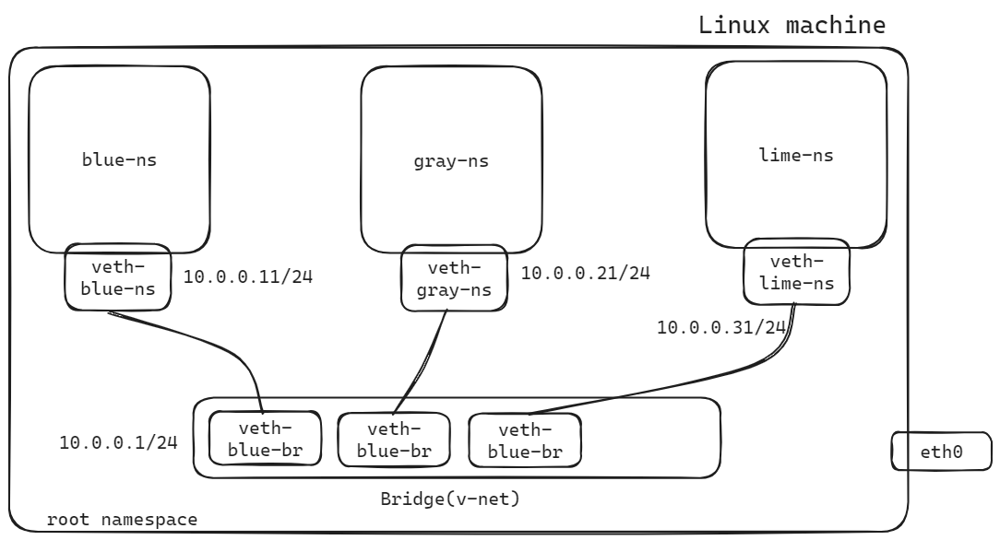

# Setting up Linux Bridge Network among Namespaces

Setting up a Linux bridge network among namespaces allows for efficient communication between isolated environments within a computing system, facilitating seamless data exchange while maintaining network segmentation.

## What is a Linux bridge

A Linux bridge is a network device that allows for the creation of virtual network segments and the bridging of network traffic between them. It operates at the data link layer (Layer 2) of the OSI model. A Linux bridge functions as a virtual switch, enabling the forwarding of network packets between different network interfaces or namespaces within the same system. Linux bridges can be used to connect network namespaces, which are isolated environments within the Linux kernel. Bridges forward packets between network interfaces or namespaces based on MAC address lookup tables (MAC tables)



## Steps to set up the Bridge network among namespaces

1. Create Linux bridge and ip address configuration

Tools like `brctl` or `ip` command can be used to create a Linux bridge interface. This bridge interface will serve as a virtual switch connecting multiple network interfaces or namespaces.

```bash
sudo ip link add dev v-net type bridge
```

2. Create required network namespaces

3. Create veth cable and configure each end of the veth cable interface to different namespaces and bridge

4. Assignment of IP addresses to the virtual interfaces and setup default route

5. Set up firewall rules according to the requirement

6. Test connectivity