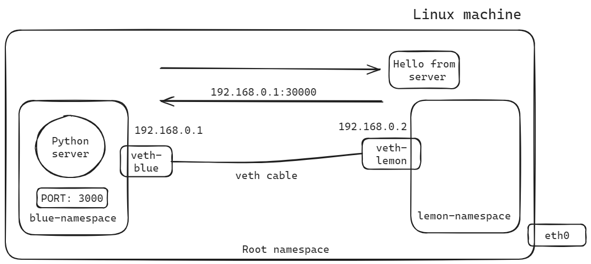

# PROCESS COMMUNICATION BETWEEN NAMESPACES

Process communication refers to the exchange of data or messages between different processes running concurrently in a computing system. Processes are independent instances of executing programs, each with its own memory space, execution context, and resources.



## Initial setup

The initial step in the process of establishing communication is to create namespaces. Subsequently, veth cables are created to establish virtual connections between the namespaces, followed by the configuration of the interfaces of these veth cables. Next, IP addresses are assigned to the interfaces of the veth cables, and connectivity is verified to ensure that all connections are properly configured.

## Creation of python server

To establish communication between namespaces, we can create a simple server in one namespace and access it from another namespace using the `curl` command. To set up a Python server in a Linux environment, we need to install necessary packages. Here are the steps:

```bash
python3 -m venv venv
source venv/bin/activate
pip3 install flask
```

## Curl the process connectivity

Assuming the Python server is running on port 3000, we can curl this server from another namespace using the IP address of that namespace and the port the server is running on. For example, if the server is running in the "blue" namespace with the IP address `192.168.0.1` and port `3000`, we can retrieve the response from the server in the "lemon" namespace using the following command:

```bash
curl -v http://192.168.0.1:3000
```

This command will send a request to the specified IP address and port, allowing us to receive the response from the Python server running in the `blue` namespace.


